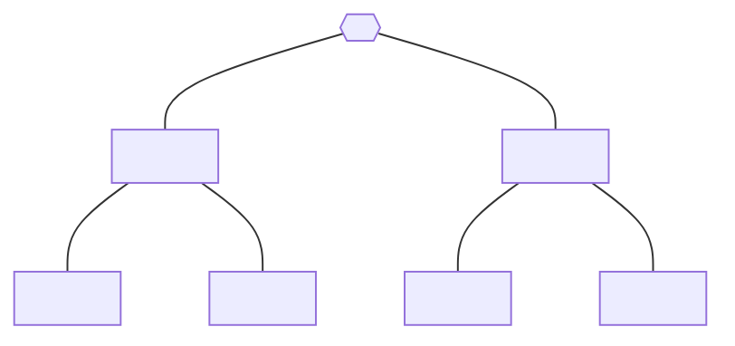
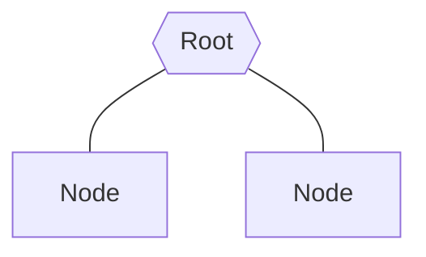
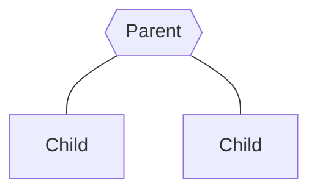
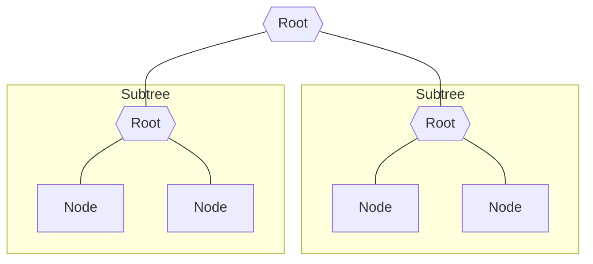
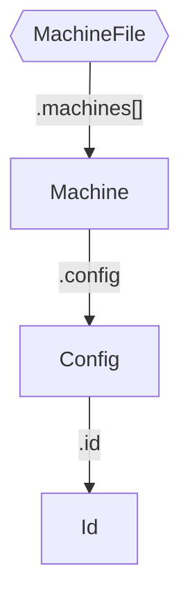
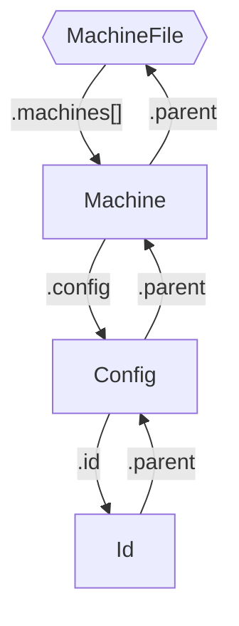
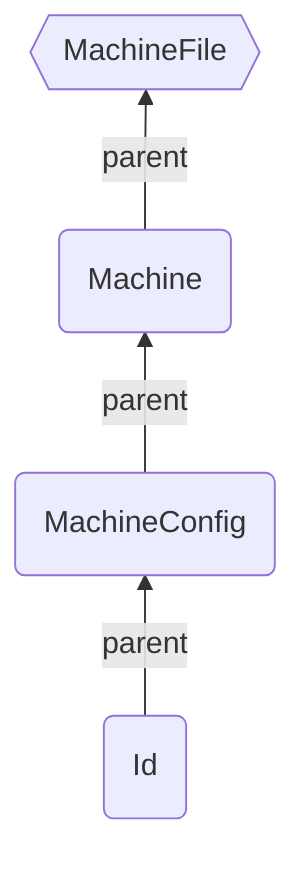

# `@xstate/tree`

`@xstate/tree` is a library of patterns for expressing [`xstate`](https://github.com/statelyai/xstate) code as a tree data structure and building tools which search, navigate, and mutate `xstate` trees.

The goal of `@xstate/tree` is to give you everything you need to contribute to the `xstate` DX (**D**eveloper e**X**perience) ecosystem:

- linting
- codegen
- codemods
- IDE extensions
- playgrounds
- embedabbles
- stuff we can't even dream of yet

This library is built following patterns similar to the [TypeScript Compiler API](https://github.com/microsoft/TypeScript/wiki/Using-the-Compiler-API) specifically, but if you're familiar with ASTs generally the patterns here should feel comfortable.

## Quick start

---

Install it:

```sh
npm install @xstate/tree
```

Now build stuff with it, like this little linter:

```ts
import {
  MachineFile,
  Node,
  forEachChild,
  getLineAndCharacterOfPosition,
  isId,
  isMachineConfig,
} from '@xstate/tree';

// - require machine config to have an `id`
// - require `id` not to be an empty string (or whitespace)
function lint(machineFile: MachineFile) {
  // traverse child nodes of the machine file, calling `visitNode` for each
  forEachChild(machineFile, visitNode);

  function visitNode(node: Node) {
    // if the node is a machine's config object
    if (isMachineConfig(node)) {
      // get the child id node
      const id = node.id;

      // report error if we have no id
      if (!id) {
        report(node, 'Machine has no id');
      }
    }

    // if the node is an id
    if (isId(node)) {
      // get the id's string value
      const value = node.value;

      // report error if it's an empty string (or whitespace)
      if (value.trim() === '') {
        report(node, 'Id cannot be an empty string (or whitespace)');
      }
    }

    // recursively traverse child nodes to make sure we lint all nodes in the
    // tree
    forEachChild(node, visitNode);
  }

  function report(node: Node, message: string) {
    // get the position of the node's text in the file
    const { line, character } = getLineAndCharacterOfPosition(
      machineFile,
      node.pos.start,
    );
    console.log(`Error at ${line}:${character}: ${message}`);
  }
}

/*
  import { createMachine } from 'xstate'

  createMachine({})
  createMachine({ id: '' })
*/
// construct nodes representing the above source code
const machineFile = factory.createMachineFile([
  // createMachine({})
  factory.createMachine(factory.createMachineConfig()),
  // createMachine({ id: '' })
  factory.createMachine(factory.createMachineConfig(factory.createId(''))),
]);

// test the little linter on the `MachineFile` node!
lint(machineFile); // logs:
// Error at 3:15: Machine has no id
// Error at 4:17: Id is an empty string (or whitespace)
```

Node types in `@xstate/tree` represent individual `xstate` code concepts, allowing us to search, navigate, and mutate familiar `xstate` structures (rather than abstract `babel` structures representing all of js/ts).

## API

### Types

Each type of node in the tree has a unique `interface` which defines properties specific to that node type:

### Predicates

Predicates are functions which identify nodes by their `kind` property and narrow the node's type, giving us type-safe access to the node type's properties:

```ts
import { isMachineFile } from '@xstate/tree';

declare const node: Node;

// if `node` is a `MachineFile` node
if (isMachineFile(node)) {
  // narrow the type of `node` to `MachineFile`, giving us type-safe access to
  // `MachineFile` properties
  console.log(`MachineFile containing ${node.machines.length} machines`);
}
```

### Factory

Factory defines a `create` and `update` function for each type of node in the tree, providing a type-safe api for creating and updating nodes:

```ts
import { factory } from '@xstate/tree';

// create an id node
const id = factory.createId('some-id');

// create a machine with the above id (`createMachine({ id: 'some-id' })`)
const machine = factory.createMachine(factory.createMachineConfig(id));

// create a new id node by updating the existing id
const newId = factory.updateId(id, 'another-id');
```

## What's a tree?

A tree is a type of data structure which organizes its data as individual nodes with hierarchical relationships between the nodes.

It's called a tree because of its shape:



A tree has a single _root_ node (the node at the top of the tree):



Each node has zero or more nodes below it (called its _child_ nodes), and each node has exactly one node above it (called its _parent_ node) except for the root node of the tree:



A child node can be thought of as the root node of its own _subtree_:



<!-- Trees can have any number of nodes and subtrees:

```mermaid
flowchart TB

root{{Root}}
node1[Root]
node11[Root]
node111[Node]
node112[Node]
node12[Root]
node121[Node]
node122[Node]
node2[Root]
node21[Root]
node211[Node]
node212[Node]
node22[Root]
node221[Node]
node222[Node]

root --- node1
root --- node2

subgraph subtree1 ["Subtree"]
  node1 --- node11
  node1 --- node12
  subgraph subtree11 ["Subtree"]
    node11 --- node111
    node11 --- node112
  end
  subgraph subtree12 ["Subtree"]
    node12 --- node121
    node12 --- node122
  end
end

subgraph subtree2 ["Subtree"]
  node2 --- node21
  node2 --- node22
  subgraph subtree21 ["Subtree"]
    node21 --- node211
    node21 --- node212
  end
  subgraph subtree22 ["Subtree"]
    node22 --- node221
    node22 --- node222
  end
end
``` -->

## Patterns

Each type of node in the tree is defined by implementing a number of patterns:

- [Types](#types)
- [Predicates](#predicates)
- [Factory](#factory)
- [Traversal](#traversal)
- [Visitors](#visitors)

By following the same patterns for each node, we end up with a clear, consistent api for growing or using the tree.

### Types

The base type for nodes in the tree is `Node`. It defines properties shared by all node types:

```ts
/** The base type for all nodes in the tree. */
export interface Node {
  /** The unique identifier for this kind of node. */
  readonly kind: NodeKind;
  /** The parent node of this node. */
  readonly parent: Node;
  /** The position of the text of this node in the file. */
  readonly pos: {
    readonly start: number;
    readonly end: number;
  };
}
```

Each node in the tree:

- extends from `Node`
- overrides `kind` with its unique `NodeKind` value (connecting the type to the value)
- relates the type to other node types
  - overrides `parent` with the node types that can be the node's parent node
  - add properties which point to other node types that are a part of the node (called its _child_ nodes)
- defines properties which contain data about the node (primitives)

As an example, let's define the node types for this tree:



```ts
/** Unique kind identifier for each type of node. */
export enum NodeKind {
  Machine = 'Machine',
  MachineConfig = 'MachineConfig',
  MachineFile = 'MachineFile',
  Id = 'Id',
}

/** A source code file which may contain machines. */
export interface MachineFile extends Node {
  readonly kind: NodeKind.MachineFile;
  // `MachineFile` is the root node, so it has no parent
  readonly parent: never;

  // property as reference to another node type (`Machine`)
  /** The machines in the file. */
  readonly machines: Machine[];
}

/** A machine definition (`createMachine` call). */
export interface Machine extends Node {
  readonly kind: NodeKind.Machine;
  readonly parent: MachineFile;

  /** The machine's config object. */
  readonly config: MachineConfig;
}

/** A machine config object. */
export interface MachineConfig extends Node {
  readonly kind: NodeKind.MachineConfig;
  readonly parent: Machine;

  /** The machine's id. */
  readonly id?: Id;
}

/** An id for a machine. */
export interface Id extends Node {
  readonly kind: NodeKind.Id;
  readonly parent: MachineConfig;

  /** The string value of the id. */
  readonly value: string;
}
```

Structuring our types in this way provides a foundation on which we can build the rest of our patterns:

- identify a node's specific type by its unique `kind` identifier ([Predicates](#predicates))
- create and update nodes using type-specific helper functions ([Factory](#factory))
- traverse up or down the nodes in the tree ([Traversal](#traversal))
- replace or remove nodes in the tree ([Visitors](#visitors))

### Predicates

> identify a node's specific type by its unique `kind` identifier

Since each node type is connected by `kind` to its unique `NodeKind`, we can identify the specific type of a node by `kind`.

For example, if a node is of kind `NodeKind.MachineFile`, the node is of type `MachineFile`:

```ts
// node of unknown type
declare const node: Node;

// if the node is of kind `MachineFile`
if (node.kind === NodeKind.MachineFile) {
  // narrow to the specific type
  const machineFile = node as MachineFile;
  // now we have type-safe property access!
  console.log(`MachineFile containing ${machineFile.machines.length} machines`);
}
```

`@xstate/tree` captures this pattern as _predicate_ functions—one for each node type:

```ts
import { isId, isMachineFile, Node } from '@xstate/tree';

declare const node: Node;

// identifies node type by `kind` (`NodeKind.MachineFile`)
if (isMachineFile(node)) {
  // also narrows `node` to the specific type (`MachineFile`)
  console.log(`MachineFile containing ${machineFile.machines.length} machines`);
}
```

You can implement the predicate pattern for a node type by defining a [type predicate](https://www.typescriptlang.org/docs/handbook/2/narrowing.html#using-type-predicates) named as `is<NodeType>`.

Here's the implementation for `isMachineFile`:

```ts
// accepts any `Node` and narrows the type of `node` to `MachineFile`
export function isMachineFile(node: Node): node is MachineFile {
  return node.kind === NodeKind.MachineFile;
}
```

### Factory

> create and update nodes using type-specific helper functions

As an example, let's create a machine node with an `id` of `some-id` and later update it to have an `id` of `another-id`:

```ts
// create an id node
const id: Id = {
  kind: NodeKind.Id,
  value: 'some-id',
  // `parent` and `pos` values are meant to be set by external tools that read
  // this data from source code, like `@xstate/parse`
  parent: {} as any,
  pos: { start: 0, end: 0 },
};

// create a machine node
let machine: Machine = {
  kind: NodeKind.Machine,
  config: {
    kind: NodeKind.MachineConfig,
    // use our id node here
    id,
    parent: {} as any,
    pos: { start: 0, end: 0 },
  },
  parent: {} as any,
  pos: { start: 0, end: 0 },
};
console.log(machine.config.id!.value); // logs: "some-id"

// update the machine's id value
const updatedMachine: Machine = {
  ...machine,
  config: {
    ...machine.config,
    id: {
      ...machine.config.id,
      value: 'another-id',
    },
  },
};
console.log(updatedMachine.config.id!.value); // logs: "another-id"
```

`@xstate/tree` captures this pattern as `factory` which defines a `create` and `update` function for each node type:

```ts
import { factory } from '@xstate/tree';

// create the id node
const id = factory.createId('some-id');

// create the machine node
const machine = factory.createMachine(
  factory.createMachineConfig(
    // use our id node here
    id,
  ),
);
console.log(machine.config.id!.value); // logs: "another-id"

// update the machine's id value by updating each node
const updatedMachine = factory.updateMachine(
  machine,
  factory.updateMachineConfig(
    machine.config,
    factory.updateId(id, 'another-id'),
  ),
);
console.log(updatedMachine.config.id!.value); // logs: "another-id"
```

### Traversal

> traverse up or down the nodes in the tree

Traversal is the process of iterating through the nodes in the tree, visiting (reading, updating, or deleting) each node _exactly once_.

The relationships between our nodes (parent and child nodes) allow us to traverse `@xstate/tree` trees using node properties.

Here's an example tree:



We can go from `MachineFile` to `Id` using the child node properties of each node _down_ the tree:

```ts
declare const machineFile: MachineFile;

const id = machineFile.machines[0].config.id;
//    ^? Id | undefined

// the above expanded:
const machine = machineFile.machines[0];
const config = firstMachine.config;
const id = config.id;
//    ^? Id | undefined
```

And we can go from `Id` to `MachineFile` using the `parent` property of each node _up_ the tree:

```ts
declare const id: Id;

const machineFile = id.parent.parent.parent;
//    ^? MachineFile

// the above expanded:
const config = id.parent;
const machine = config.parent;
const machineFile = machine.parent;
//    ^? MachineFile
```

These relationships allow `@xstate/tree` to capture common traversal techniques and provide tools for them.

#### `forEachChild`

`forEachChild` captures the logic defining a node type's child nodes and how to handle each for each node type that has children.

This means we can declaratively traverse the child nodes of _any_ node type through a generic interface.

Consumer code remains focused on declaring the logic for the specific use case:

```ts
import {
  Node,
  forEachChild,
  isId,
  isMachine,
  isMachineConfig,
  isMachineFile,
} from '@xstate/tree';

declare const node: Node;

// traverse the node, calling `callback` for each of its child nodes
forEachChild(node, callback);

function callback(child: Node) {
  console.log(child.kind);
}

// behavior changes based on the types of the node's child nodes
forEachChild(machineFile, callback); // logs "Machine" for each machine
forEachChild(machine, callback); // logs "MachineConfig"
forEachChild(machineConfig, callback); // logs "Id"
forEachChild(id, callback); // does nothing because `Id` has no children
```

`forEachChild` can also traverse _all_ nodes in a tree when called recursively:

```ts
import { Node, factory, forEachChild } from '@xstate/tree';

const machineFile = factory.createMachineFile([
  // machine with an id
  factory.createMachine(
    factory.createMachineConfig(factory.createId('some-id')),
  ),
  // machine with no id
  factory.createMachine(factory.createMachineConfig()),
]);

// call `callback` with each child node
forEachChild(machineFile, function callback(node: Node) {
  console.log(`Node of kind ${node.kind}`);

  // inside the callback, call `forEachChild` with the child and `callback` again to make it recursive
  forEachChild(node, callback);
});
// logs:
// "Node of kind Machine" (machineFile.machines[0])
// "Node of kind MachineConfig"
// "Node of kind Id"
// "Node of kind Machine" (machineFile.machines[1])
// "Node of kind MachineConfig"
```

#### `findAncestor`

> We can traverse _up_ the tree using the `parent` property.

Since each node type has a `parent` property, we can access _from anywhere in the tree_ a node's ancestors (parent, parent's parent, etc.) all the way up to the root `MachineFile` node:

```ts
declare const id: Id;

const machineFile: MachineFile = id.parent.parent.parent;
// id.parent: MachineConfig
// id.parent.parent: Machine
```



`@xstate/tree` captures this pattern as the `findAncestor` function which finds a specific ancestor:

```ts
import { findAncestor, Machine, Node, NodeKind } from '@xstate/tree';

declare const node: Node;

const machine: Machine | undefined = findAncestor<Machine>(
  node,
  (ancestor) => ancestor.kind === NodeKind.Machine,
);
```

If we use a predicate with `findAncestor`, it will automatically narrow the type of its result:

```ts
import { findAncestor, Node, isMachine } from '@xstate/tree';

declare const node: Node;

const machine = findAncestor(node, isMachine);
//    ^? Machine | undefined
```

### Visitors

> replace or remove nodes in the tree

#### `visitNode`

#### `visitEachChild`
