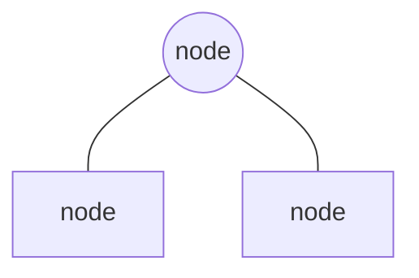
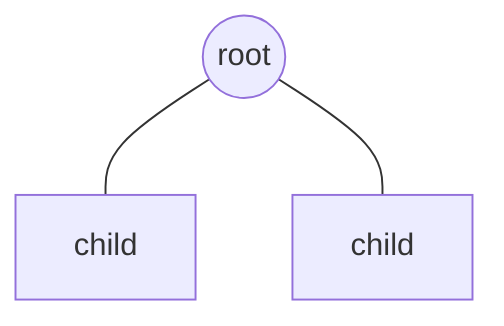
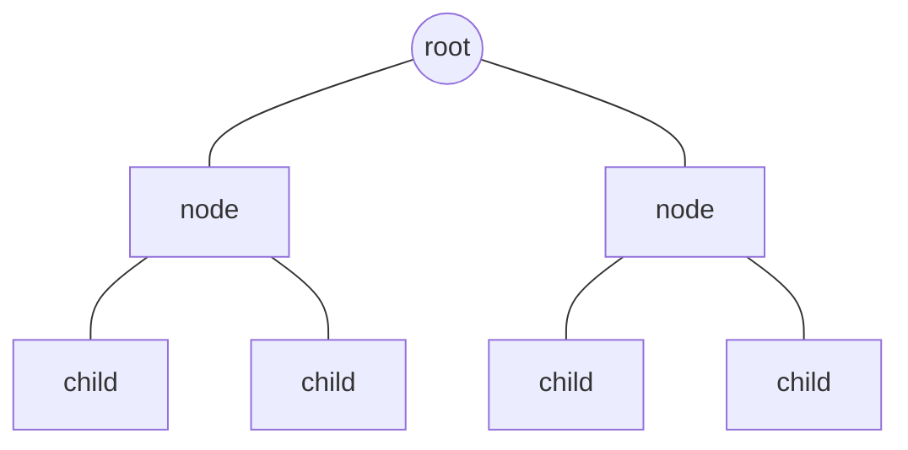
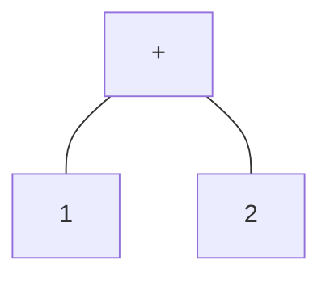

## Patterns

Each type of node in the tree is defined by implementing a number of patterns. Each pattern provides a specific piece of functionality for the node.

### Types

Types are the foundation of the tree. They define the shape of the nodes in the tree and the relationships between them.

Each node type:

- has a unique identifier (`NodeKind`)

  ```ts
  export enum NodeKind {
    Machine = 'Machine',
  }
  ```

- extends from the base `Node` type

  ```ts
  export interface Node {
    /** The unique identifier of this type of node. */
    readonly kind: NodeKind;
    /** The parent node of the node. */
    readonly parent: Node;
  }
  ```

- defines its own type containing properties specific to the node

  ```ts
  /** A machine definition (`createMachine` call). */
  export interface Machine extends Node {
    readonly kind: NodeKind.Machine;
    readonly parent: MachineFile;

    /** The machine's config object. */
    readonly config: MachineConfig;
  }
  ```

A node type is defined as:

- a unique `kind` identifier (on `enum NodeKind`)
- an exported `interface` (which `extends Node`)
  - `readonly` overrides for properties inherited from `Node`
  - `readonly` properties containing data about the node or references to other node types

Here's an example node type:

```ts
/** Represents a machine config object. */
export interface MachineConfig {
  readonly kind: NodeKind.MachineConfig;
  readonly parent: Machine;

  // property containing data about the node
  readonly initial: string;
  // property referencing another node type
  readonly id: Id;
}
```

```ts
/**
 * Unique kind identifier for each node type.
 */
export enum NodeKind {
  Machine = 'Machine',
  MachineFile = 'MachineFile',
  MachineConfig = 'MachineConfig',
}

/**
 * Base type from which all other node types extend. Represents a node of
 * unknown type.
 */
export interface Node {
  /** Unique identifier for this type of node. */
  readonly kind: NodeKind;
  /** The parent node of the node. */
  readonly parent: Node;
}

/** Represents a source code file which may contain machines. */
export interface MachineFile {
  readonly kind: NodeKind.MachineFile;
  readonly parent: never;

  /** The machines in the file. */
  readonly machines: Machine[];
}

/** Represents a machine definition (`createMachine` call). */
export interface Machine {
  readonly kind: NodeKind.Machine;
  readonly parent: MachineFile;

  /** The machine's config object. */
  readonly config: MachineConfig;
}

/** Represents a machine config object. */
export interface MachineConfig {
  readonly kind: NodeKind.MachineConfig;
  readonly parent: Machine;
}
```

### Predicates

### Factory

### Traverse

## Overview

`@xstate/tree` is a library for expressing `xstate` code as a tree data structure.

### What's a tree?

Trees represent data as a collection of nodes which are connected to each other in hierarchical relationships.



The top node in the tree is called the _root_ node. The nodes below it are called its _child_ nodes. The root node is called the _parent_ node of its children.



Each node can have one or more child nodes, and those nodes can have their own child nodes, making the tree a recursive structure.



### Why use a tree?

Trees represent and organize data in a way that makes it easy to navigate, search, and modify.

To demonstrate, we'll define a tree that represents simple math equations like `1 + 2`.

To start, let's break down the equation:

- it has an operator (`+`)
- it has a number to the left of the operator (`1`)
- it has a number to the right of the operator (`2`)

Knowing what we know about trees, here's how we might describe the tree for equations:

- it has two types of nodes: one for the plus operator and one for numbers
- the plus operator node is the root node
- the root's child nodes are numbers

If we visualize the equation as a tree with these nodes, here's how it looks:



Now let's define this tree in code:

```ts
// root node
interface Plus {
  type: 'plus';
  left: Number;
  right: Number;
}

interface Number {
  type: 'number';
  value: number;
}

const add1And2: Plus = {
  type: 'plus',
  left: {
    type: 'number',
    value: 1,
  },
  right: {
    type: 'number',
    value: 2,
  },
};
```

### Familiarity

Follows patterns similar to the `typescript` api compiler, which follows abstract syntax tree patterns generally.

If you're familiar with syntax trees, these patterns and concepts will likely feel comfortable for you here:

- types
- predicates
- node factories
- traversal
- visitors

## How to build this library

Each type of node in the tree implements the same couple of patterns:

- types
- predicates
- factories

Each pattern contributes a small piece of functionality to the tree. When combined, the patterns give us a reliable foundation for building anything based on the `xstate` tree, including the library itself.

To understand the patterns, let's implement each one for two node types:

- `MachineFile`: the root node of our tree. a file that may contain machines
- `Machine`: a `createMachine({})` call

### 1. `types.ts`

Types define the shape of nodes in the tree and the relationships between them.

There are four steps to defining a new node type:

1. add a unique entry for the type to `NodeKind`

   _Note_: We use `jsdoc` comment blocks (between `/**` and `*/`) to attach information which is displayed in editor tooltips. This adds a layer of context which is displayed to developers wherever they interact with the _thing_. Good library experience 👍

   ```ts
   /**
    * Unique kind identifier for each node type.
    */
   export enum NodeKind {
     MachineFile = 'MachineFile',
     Machine = 'Machine',
   }
   ```

2. export an `interface` for the node type which `extends Node`

   _Note_: We use the `readonly` modifier for all node properties. This makes nodes read-only, but we'll later add patterns that enable mutating nodes only in specific situations.

   ```ts
   /** The base node type. */
   export interface Node {
     /** The unique `NodeKind` of this node type. */
     readonly kind: NodeKind;
   }

   export interface MachineFile extends Node {}

   export interface Machine extends Node {}
   ```

3. add the `kind` property which connects the node type to its unique `NodeKind` entry

   ```diff
   -export interface MachineFile extends Node {}
   +export interface MachineFile extends Node {
   +  readonly kind: NodeKind.MachineFile;
   +}

   -export interface Machine extends Node {}
   +export interface Machine extends Node {
   +  readonly kind: NodeKind.Machine;
   +}
   ```

4. add node-specific properties containing data or other node types (the node's "child" nodes)

   ```diff
    export interface MachineFile extends Node {
      readonly kind: NodeKind.MachineFile;
   +
   +  /** The machines in the file. */
   +  readonly machines: Machine[];
    }

    export interface Machine extends Node {
      readonly kind: NodeKind.Machine;
   +
   +  /** Machine config object for the machine. */
   +  readonly config: {};
    }
   ```

<details>
  <summary>Expand to see the full code sample</summary>

```ts
/** The base node type. */
export interface Node {
  /** The unique `NodeKind` of this node type. */
  readonly kind: NodeKind;
}

export interface MachineFile extends Node {
  readonly kind: NodeKind.MachineFile;

  /** The machines in the file. */
  readonly machines: Machine[];
}

export interface Machine extends Node {
  readonly kind: NodeKind.Machine;

  /** Machine config object for the machine. */
  readonly config: {};
}

export interface Machine extends Node {
  readonly kind: NodeKind.Machine;
}
```

</details>

With just a few lines of types, we give ourselves a solid foundation of types on top of which we can build our other patterns:

1.  we can uniquely identify the specific node type of any `Node` with `kind`:

    ```ts
    // identifying `Machine` nodes by their unique `NodeKind.Machine` entry
    if (node.kind === NodeKind.Machine) {
    }
    ```

2.  identifying the type means we can safely _narrow_ the type of `Node` to its more specific type:

    ```ts
    if (node.kind === NodeKind.Machine) {
      // we know `node` is of type `Machine`
      const machine = node as Machine;
      // we can now safely access `Machine`-specific properties
      console.log(`Machine config: ${machine.config}`);
    }
    ```

3.  we can use `Node` as a generic stand-in for _any_ node type:

    ```ts
    // `Node` allows us to accept any node type
    function logNode(node: Node) {
      // all nodes can access `kind` (defined on `Node`)
      console.log(`NodeKind: ${node.kind}`);

      if (node.kind === NodeKind.Machine) {
        // because we identified `kind` as `NodeKind.Machine`, we know `node` is of type `Machine`
        const machine = node as Machine;
        // we can safely access properties from `Machine`
        console.log(`Machine.config: ${machine.config}`);
      }
    }

    // with a `MachineFile` node
    logNode({
      kind: NodeKind.MachineFile,
      machines: [],
    }); // logs "NodeKind: MachineFile"

    // with a `Machine` node
    logNode({
      kind: NodeKind.Machine,
      config: {},
    }); // logs "NodeKind: Machine", then "Machine.config: {}"
    ```

### 2. `predicates.ts`

Predicates combine the benefits of `types` into a single [type predicate](https://www.typescriptlang.org/docs/handbook/2/narrowing.html#using-type-predicates) function which is used to identify nodes as a specific node type.

There are four steps to defining a predicate:

1. export a function with a name following the pattern `is<NodeName>`

   ```ts
   export function isMachineFile() {}

   export function isMachine() {}
   ```

2. accept a `Node` parameter (which represents a node of unknown type)

   ```diff
   -export function isMachineFile() {}
   +export function isMachineFile(node: Node) {}

   -export function isMachine() {}
   +export function isMachine(node: Node) {}
   ```

3. add a type predicate which narrows the type of `node` from `Node` to the node type if the function returns `true`

   ```diff
   -export function isMachineFile(node: Node) {}
   +export function isMachineFile(node: Node): node is MachineFile {}

   -export function isMachine(node: Node) {}
   +export function isMachine(node: Node): node is Machine {}
   ```

4. return the logic for identifying a node by its unique `kind`

   ```diff
   -export function isMachineFile(node: Node): node is MachineFile {}
   +export function isMachineFile(node: Node): node is MachineFile {
   +  return node.kind === NodeKind.MachineFile;
   +}

   -export function isMachine(node: Node): node is Machine {}
   +export function isMachine(node: Node): node is Machine {
   +  return node.kind === NodeKind.Machine;
   +}
   ```

Here's the full code:

```ts
export function isMachineFile(node: Node): node is MachineFile {
  return node.kind === NodeKind.MachineFile;
}

export function isMachine(node: Node): node is Machine {
  return node.kind === NodeKind.Machine;
}
```

Predicates provide us with a single source of truth for identifying a node with an unknown type as the node type, allowing us to safely access properties for specific node types:

```ts
// `Node` of unknown type
declare const node: Node;

// we can access `kind` on any `Node`
console.log(`Node of kind ${node.kind}`);

if (isMachineFile(node)) {
  // `node` is narrowed by `isMachineFile` to `MachineFile` here
  console.log(`Machine with ${node.machines.length} machines`);
}

if (isMachine(node)) {
  // `node` is narrowed by `isMachine` to `MachineFile` here
  console.log(`Machine with config: ${machine.config}`);
}
```

We can use them anywhere we need to identify specific types of nodes and narrow their type:

```ts
declare const node: Node;
if (isMachineFile(node)) {
  console.log(`MachineFile with ${node.machines.length} machines`);
}

declare const nodes: Node[];
const machineFiles: MachineFile[] = nodes.filter(isMachineFilter);
const machines: Machine[] = nodes.filter(isMachine);
```

### 3. `factory.ts`
