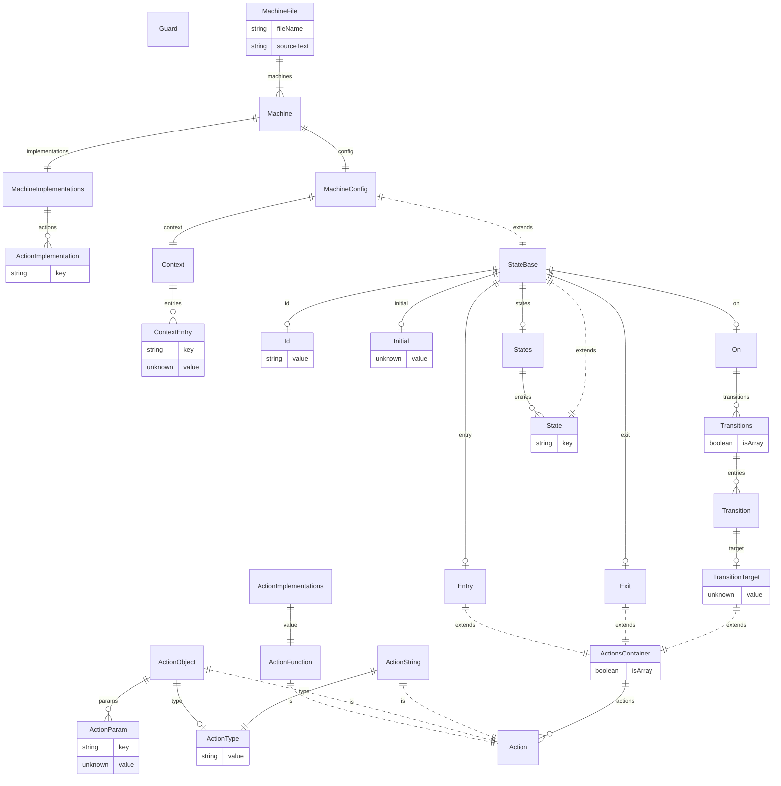

```mermaid
erDiagram
	Action {

	}

	ActionImplementations ||--|| ActionFunction : value
	ActionImplementation {
		string key
	}

	ActionFunction ||..|| Action : is
	ActionFunction {
	}

	ActionObject ||..|| Action : is
	ActionObject ||--|o ActionType : type
	ActionObject ||--o{ ActionParam : params
	ActionObject {

	}

	ActionParam {
		string key
		unknown value
	}

	ActionString ||..|| Action : is
	ActionString ||--|| ActionType : type
	ActionString {

	}

	ActionType {
		string value
	}

	ActionsContainer ||--o{ Action : actions
	ActionsContainer {
		boolean isArray
	}

	Context ||--o{ ContextEntry : entries
	Context {

	}

	ContextEntry {
		string key
		unknown value
	}

	Entry ||..|| ActionsContainer : extends
	Entry {

	}

	Exit ||..|| ActionsContainer : extends
	Exit {

	}

	Guard {

	}

	Id {
		string value
	}

	Initial {
		unknown value
	}

	Machine ||--|| MachineConfig : config
	Machine ||--|| MachineImplementations : implementations
	Machine {

	}

	MachineConfig ||..|| StateBase : extends
	MachineConfig ||--|| Context : context
	MachineConfig {

	}

	MachineImplementations {

	}

	MachineFile ||--|{ Machine : machines
	MachineFile {
		string fileName
		string sourceText
	}

	MachineImplementations ||--o{ ActionImplementation : actions
	MachineImplementations {

	}

	On ||--o{ Transitions : transitions
	On {

	}

	State ||..|| StateBase : extends
	State {
		string key
	}

	StateBase ||--|o Entry : entry
	StateBase ||--|o Exit : exit
	StateBase ||--|o Id : id
	StateBase ||--|o Initial : initial
	StateBase ||--|o On : on
	StateBase ||--|o States : states
	StateBase {

	}

	States ||--o{ State : entries
	States {

	}

	Transitions ||--o{ Transition : entries
	Transitions {
		boolean isArray
	}

	Transition ||--|o TransitionTarget : target
	Transition {

	}

	TransitionTarget ||..|| ActionsContainer : extends
	TransitionTarget {
		unknown value
	}
```
